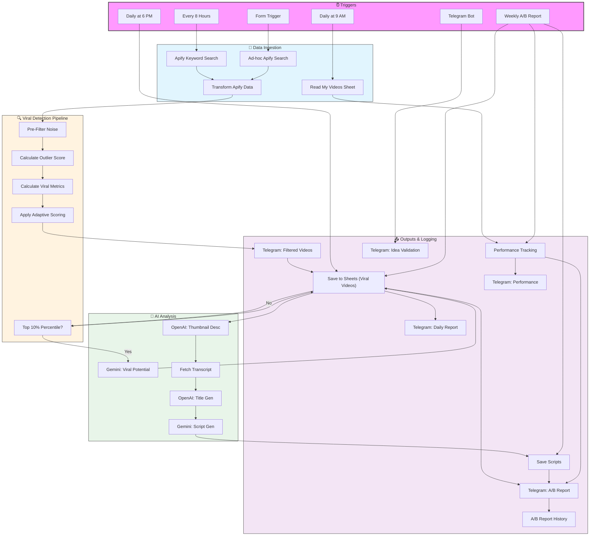

# 🚀 YouTube Viral Content Automation with n8n

An end‑to‑end automation system that scrapes trending YouTube videos, scores their viral potential, generates AI‑powered scripts and titles, and delivers real‑time alerts via Telegram.

## 📌 Features
- **Apify Scraping** – Fetches latest videos by keyword every 8 hours.
- **Viral Detection Algorithm** – Calculates outlier score, velocity, and momentum.
- **AI Analysis** – Gemini identifies trending angles; OpenAI analyzes thumbnails and generates titles.
- **Script Generation** – Creates complete YouTube Short scripts with hooks and CTAs.
- **Telegram Alerts** – Real‑time validation, daily reports, and A/B performance summaries.
- **Google Sheets Logging** – Full historical tracking and dashboarding.

## 🧰 Tech Stack
- n8n (Workflow Automation)
- Apify YouTube Scrapers
- Google Gemini & OpenAI GPT‑4o
- Telegram Bot API
- Google Sheets API

## 🚦 How to Use
1. Import `workflow.json` into your n8n instance.
2. Add your API keys for Apify, OpenAI, Gemini, Telegram, and Google Sheets.
3. Activate the workflow and optionally trigger via form or schedule.
   
## 📊 Workflow Architecture Diagram

## 📸 Screenshots
*(Add images of the workflow canvas and Telegram messages)*

## 📄 License
MIT
